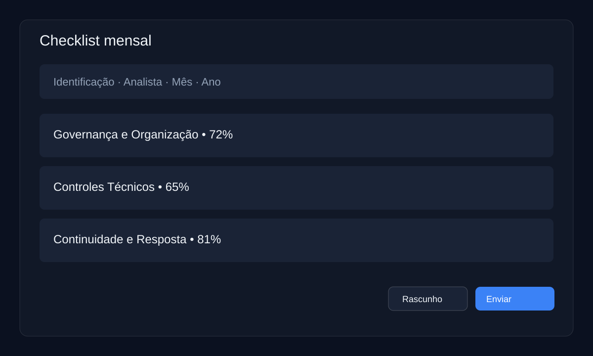
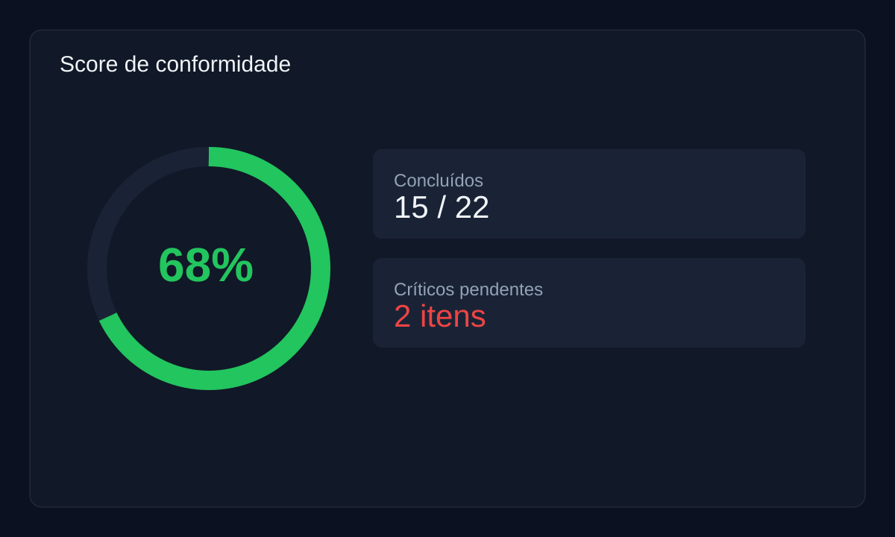
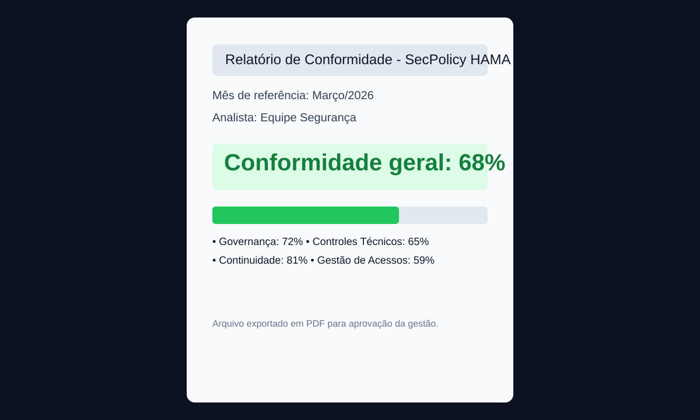

<div align="center">


# 🛡️ SecPolicy HAMA

**Gestão mensal de políticas de segurança da informação para instituições de saúde.**  
Baseado em **ISO/IEC 27001** · Next.js 14 + TypeScript · Deploy no Vercel.

[](https://vercel.com)
[](https://nextjs.org/)
[](https://www.typescriptlang.org/)
[](https://www.iso.org/isoiec-27001-information-security.html)
[](https://opensource.org/licenses/MIT)

</div>

---

## 📋 Sobre o Projeto

O **SecPolicy HAMA** é uma aplicação web desenvolvida para a **HAMA (Hospital e Maternidade de Aracaju)** com o objetivo de digitalizar e padronizar o processo de conformidade com políticas de segurança da informação.

A ferramenta substitui planilhas manuais por um fluxo estruturado: o analista preenche o checklist mensal, a pontuação de conformidade é calculada em tempo real e um relatório PDF é gerado automaticamente para aprovação da gestão.

> Desenvolvido com base nos controles da **ISO/IEC 27001**, adaptado à realidade de infraestrutura de saúde pública.

---

## ✨ Funcionalidades

| Funcionalidade | Descrição |
|---|---|
| 📋 **Checklist mensal** | 22 itens organizados em 5 categorias |
| 🎯 **Criticidade por item** | Alta / Média / Baixa |
| 📊 **Pontuação em tempo real** | Índice de conformidade calculado automaticamente |
| 📄 **Relatório PDF** | Gerado no cliente com jsPDF, sem servidor |
| 🗂️ **Histórico de meses** | Registro de todos os checklists preenchidos |
| ✅ **Fluxo de aprovação** | Analista → Gestão |
| 💾 **Auto-save** | Rascunho salvo automaticamente no navegador |
| ☁️ **Firestore** | Persistência em nuvem por usuário autenticado |
| 📄 **Versionamento** | Cada edição cria uma nova versão da política |
| 📊 **Auditoria** | Log de criação/alteração com status e versão |

---

## 🖼️ Demo Visual (Landing + Fluxo)

A home agora funciona também como **landing/demo** do produto, com destaque para:

- proposta de valor do fluxo mínimo;
- cards de demonstração (Checklist → Score → PDF);
- KPI rápido de histórico e status atual.

### Screenshots

#### Checklist mensal


#### Score de conformidade


#### Relatório PDF


---

## 🛠️ Stack Tecnológica

| Tecnologia | Uso |
|---|---|
| **Next.js 14** | Framework React com App Router |
| **TypeScript** | Tipagem estática |
| **Tailwind CSS** | Estilização utilitária |
| **jsPDF** | Geração de relatório PDF no cliente |
| **Firebase Auth** | Identificação do usuário (anônimo) |
| **Cloud Firestore** | Persistência, versionamento e trilha de auditoria |
| **DM Sans / DM Mono** | Tipografia |

---

## 🚀 Setup Local

```bash
# 1. Clonar o repositório
git clone https://github.com/fernando-msa/secpolicy-hama.git
cd secpolicy-hama

# 2. Instalar dependências
npm install

# 3. Rodar localmente
npm run dev
```

Acesse **http://localhost:3000**

> Configure as variáveis de ambiente do Firebase antes de rodar localmente:

```bash
NEXT_PUBLIC_FIREBASE_API_KEY=
NEXT_PUBLIC_FIREBASE_AUTH_DOMAIN=
NEXT_PUBLIC_FIREBASE_PROJECT_ID=
NEXT_PUBLIC_FIREBASE_STORAGE_BUCKET=
NEXT_PUBLIC_FIREBASE_MESSAGING_SENDER_ID=
NEXT_PUBLIC_FIREBASE_APP_ID=
NEXT_PUBLIC_FIREBASE_MEASUREMENT_ID=
```

> Caso as variáveis não sejam informadas, o projeto usa o fallback definido em `lib/firebase.ts` para o projeto `secpolicy-hama`.

Para backend com conta de serviço (Admin SDK), há um template em `lib/firebase-admin.ts`.

---

## ☁️ Deploy no Vercel

**Via CLI:**

```bash
npm i -g vercel
vercel login
vercel --prod
```

**Via painel:** conecte o repositório GitHub diretamente em [vercel.com/new](https://vercel.com/new) e clique em Deploy — sem configuração adicional.

---

## 📁 Estrutura do Projeto

```
secpolicy-hama/
├── app/
│   ├── layout.tsx            # Layout raiz com fontes
│   ├── page.tsx              # Dashboard / histórico
│   ├── globals.css           # Design system (CSS variables)
│   └── checklist/
│       └── [id]/
│           └── page.tsx      # Preenchimento e visualização
├── data/
│   └── politicas.json        # Itens do checklist (editável)
└── lib/
    ├── types.ts              # Tipos TypeScript
    ├── storage.ts            # localStorage + cálculos
    └── pdf.ts                # Geração de PDF com jsPDF
```

---

## ⚙️ Personalizar Itens do Checklist

Edite `data/politicas.json` para adicionar, remover ou alterar categorias e itens.

Cada item contém:

```json
{
  "id": "identificador-unico",
  "texto": "Descrição do item de conformidade",
  "criticidade": "Alta" | "Média" | "Baixa"
}
```

> ⚠️ Não altere o `id` de um item após já ter dados salvos — isso quebrará o histórico existente.

---

## 🗺️ Próximos Passos

Os próximos passos já foram estruturados para abertura de issues em `docs/roadmap-issues.md` e via template `.github/ISSUE_TEMPLATE/proximos-passos.md`.

- [ ] Integração com **Resend** para envio de e-mail automático após submissão
- [ ] Página `/gestao` para aprovação ou solicitação de ajustes pela chefia
- [ ] Export para **Excel** além de PDF
- [ ] Notificação automática no dia 1° de cada mês

---

## 🚢 Release do fluxo mínimo

Quando o fluxo mínimo estiver fechado (checklist → score → PDF + aprovação inicial), publique um release seguindo:

1. Atualizar `README` e screenshots da versão estável.
2. Garantir que as issues de escopo mínimo estejam fechadas.
3. Criar tag semântica (ex.: `v0.1.0`) e publicar release no GitHub.
4. Anexar notas com: melhorias visuais, limitações atuais e próximos incrementos.

---

## 📄 Licença

Distribuído sob a licença **MIT**. Veja [`LICENSE`](./LICENSE) para mais detalhes.

---

<div align="center">

Desenvolvido por [Fernando S. De Santana Júnior](https://github.com/fernando-msa)  
Analista de Infraestrutura · HAMA · Aracaju/SE

[](https://www.linkedin.com/in/fernando-junior-1a74ab29b/)

</div>
